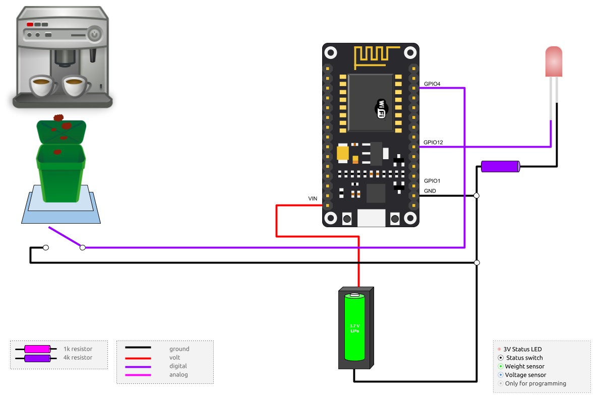

===============
coffee-bin-mqtt
===============

.. image:: https://readthedocs.org/projects/coffee-bin-mqtt/badge/?version=latest
    :target: https://coffee-bin-mqtt.readthedocs.io/en/latest/?badge=latest
    :alt: Documentation Status

MQTT sensor project for `CoffeeBin <https://github.com/vergissberlin/coffee-bin>`_. 

Features
========

- It uses deep sleep ,ode to save energy.
- It messures the volatage on bootup an send the result as MQTT message to the broker.
- It has an external status LED
- It has an switch to broadcast an MQTT message, that the coffe machine is in maintenance mode.

Hardware
========

- ESP8266 ESP12F
    - Flash Size:   32 Mbit
    - Flash Mode:   DIO
    - Flash Speed:  40 MHz
- LED
- Switch
- Voltage sensor

Wiring
======

|CoffeeBin wiring| \
`Download PDF [ 196kb ] <https://github.com/vergissberlin/coffee-bin-mqtt/raw/master/docs/img/coffeebin-mqtt.pdf>`_ \
| `Download PNG [ 121kb ] <https://github.com/vergissberlin/coffee-bin-mqtt/raw/master/docs/img/coffeebin-mqtt.png>`_ \
| `Download SVG [622kb ] <https://github.com/vergissberlin/coffee-bin-mqtt/raw/master/docs/img/coffeebin-mqtt.svg>`_

Development
===========

Preparation
-----------

Install the USB driver for your ESP8266 and find out on which
port your device is avaible. For convinience you can save that
information in your `~/.bashrc` or `~/.bash_profile` file.

.. code: bash

    export MOS_PORT=/dev/cu.SLAB_USBtoUART

If you don't wanna do that, you have to add the port to each 
command.

.. code:: bash

    mos --port /dev/cu.SLAB_USBtoUART COMMAND

Build
-----

You need to install Docker to build it locally.

.. code:: bash

    git clone https://github.com/vergissberlin/coffee-bin-mqtt
    cd coffee-bin-mqtt
    mos build --platform ESP8266 --local --verbose
    mos flash --esp-erase-chip --esp-baud-rate 115200 --esp-flash-params "dio,4m,40m"

Debugging and configuration
---------------------------

.. code:: bash

    mos wifi --port /dev/cu.SLAB_USBtoUART WIFI-SSID WIFI-PASSWORD
    mos console --port /dev/cu.SLAB_USBtoUART

Upload files
------------

.. code:: bash

    mos put --port /dev/cu.SLAB_USBtoUART fs/init.js
